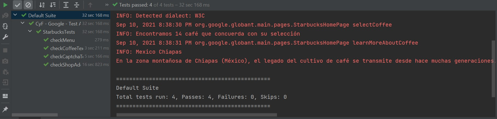
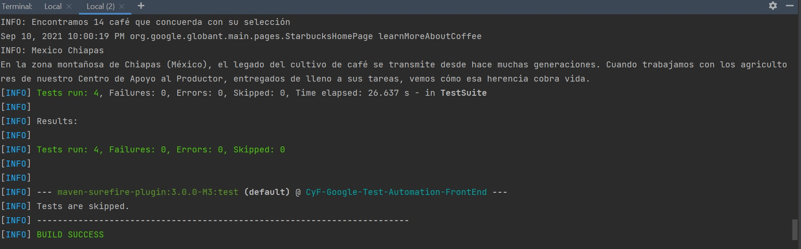

# Test Automation for Front-End

## Usage
To run the framework, use the bazel command:

bazel test //src/test/java/org/google/globant/tests:StarbucksTests --strict_java_deps=OFF

you can reset the bazel build with bazel clean

### Result: 

### Result:

## Author

Oscar Andres Montes
